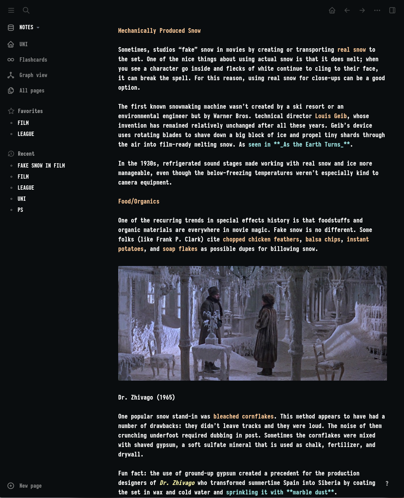

# SAGA for Logseq

A dark theme for [Logseq](https://logseq.com/).

  

## Installation
1. `wget https://raw.githubusercontent.com/SAGAtheme/LOGSEQ/master/custom.css`  
2. Move the custom.css file into the logseq folder in your vault. 

## Notes
- The theme uses Iosevka Heavy as its font. You can find it [here](https://github.com/be5invis/Iosevka). If you want to use a different font it is set in custom.css at line 27.  

## License

[MIT License](./LICENSE)

